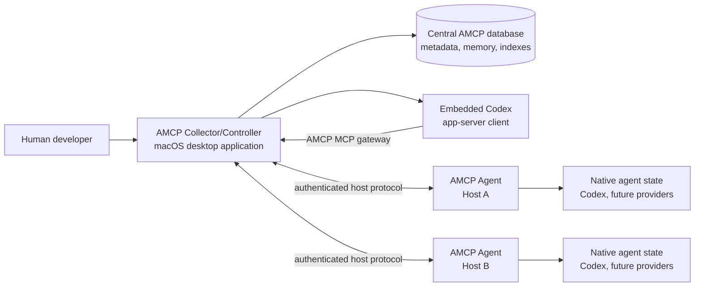
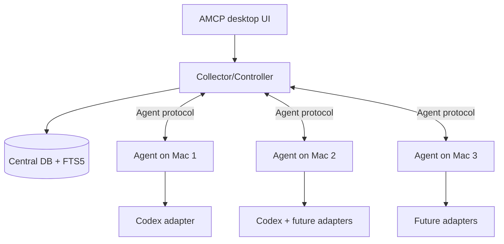
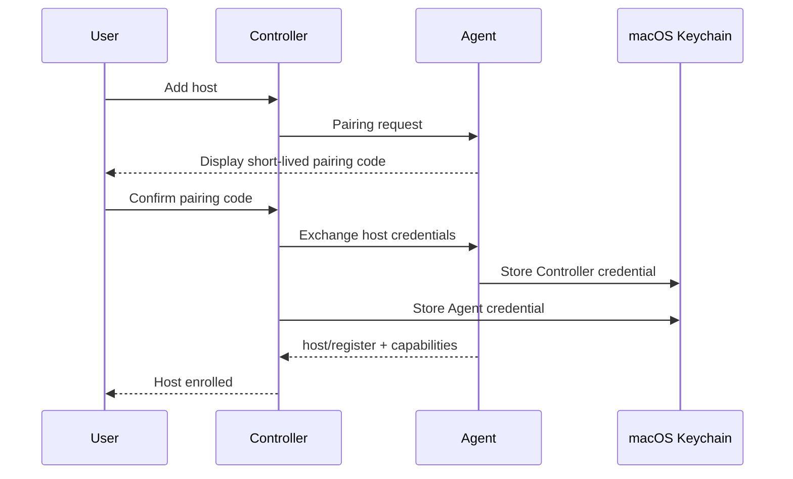
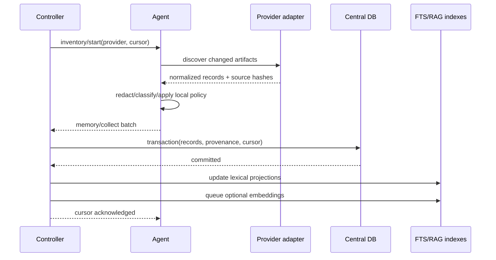
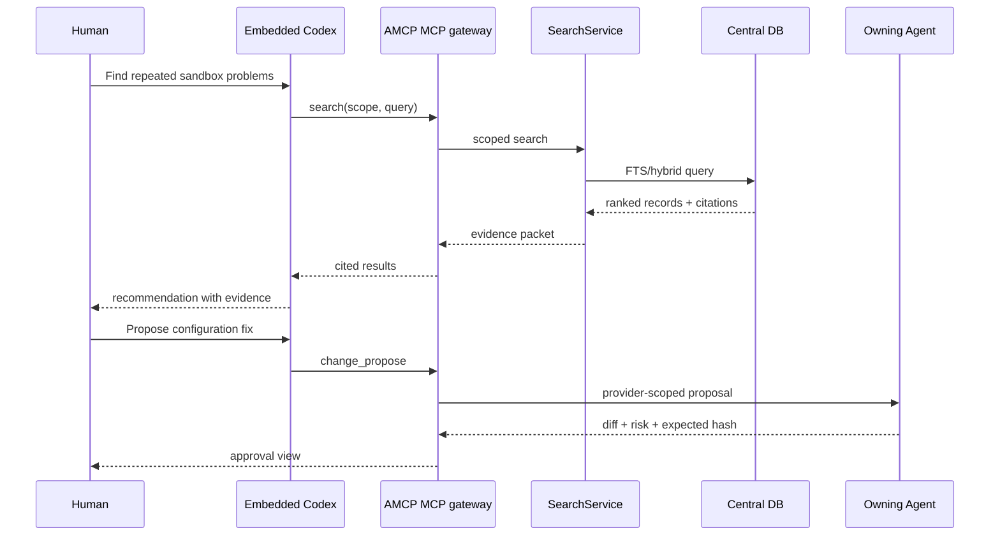

# AMCP Collector/Controller and Agent

High-Level Design (HLD)

Status: Initial design

Target platform: macOS first; Windows and Linux are planned extensions

Related document: [Initial Brief and Specification](INITIAL-BRIEF-AND-SPEC.md)

Implementation roadmap: [AMCP implementation plan](PLAN-IMPLEMENTACJI.md)

## 1. Purpose and scope

This document defines the architecture of the two primary AMCP runtime components:

- **AMCP Collector/Controller** — the central application that owns the collected memory/catalog database, indexes, human UI, host registry, approvals, and embedded Codex experience.
- **AMCP Agent** — the local service installed on each system that discovers and safely operates on native coding-agent state.

The first implementation targets a single macOS user account and one or more macOS hosts. The architecture must keep operating-system facilities behind interfaces so the same functional core can later run on Windows and Linux.

This HLD does not define the internal implementation of every provider adapter. Codex is the first provider; Claude Code, Antigravity, Kiro, and future providers use the same adapter contract.

## 2. Design goals

- Keep native agent files and databases authoritative on their source host.
- Collect normalized memory, configuration, guidance, session, and tooling information centrally.
- Provide one search and retrieval service for humans and embedded agents.
- Make optional RAG derived, consent-controlled, rebuildable, and citation-backed.
- Ensure the Controller cannot bypass local Agent policy.
- Make all writes reviewable, atomic, auditable, and reversible where technically possible.
- Support local/offline operation when the Controller or a remote host is unavailable.
- Use Rust for the functional core, services, protocols, and security-sensitive operations.
- Make macOS integration excellent without coupling the core domain model to macOS.

## 3. Non-goals

- Reimplementing Codex or another provider’s model runtime.
- Replacing provider-native authentication, sandboxing, or approval systems.
- Replicating all raw transcripts or private state by default.
- Making the Controller a remote filesystem browser.
- Exposing a network listener by default on macOS.
- Supporting Windows/Linux in the first delivery.

## 4. System context



The Controller is the central coordination and human-facing component. The Agent is the local authority for a host. The Controller may request an operation, but the Agent decides whether it is permitted and executes it locally.

## 5. Deployment topology

### 5.1 Local single-host mode

The desktop application starts or connects to a local Agent. Both run under the same macOS user account.

```text
AMCP.app
  ├── Collector/Controller process
  ├── embedded Codex app-server client
  └── local Agent process/service
       ├── Codex provider adapter
       ├── local discovery/index cache
       └── local file operations
```

This is the primary hackathon and first-release topology.

### 5.2 Central Controller with multiple hosts

The Controller runs on one macOS system. Each additional system runs an Agent and enrolls with the Controller.



### 5.3 Future server mode

The Controller database and protocol should later support a headless central deployment. The desktop UI becomes a client, while Agents remain responsible for local state. This mode is not required for the macOS MVP.

## 6. Runtime boundaries

### 6.1 Collector/Controller owns

- Human UI and user interaction.
- Host enrollment and connection management.
- Central normalized catalog and memory database.
- Federated lexical search and optional semantic retrieval.
- Saved searches, tags, aliases, and cross-host relationships.
- Change review and user approval workflow.
- Controller-level audit view and operation coordination.
- Embedded Codex conversation and AMCP MCP gateway.
- Controller configuration and database migrations.

### 6.2 Agent owns

- Host identity and local capability report.
- Provider discovery and provider adapter lifecycle.
- Reading native configuration, guidance, memory, session, and tooling state.
- Local parsing, redaction, hashing, and source provenance.
- Local index/cache for offline operation.
- Local file permissions, path allowlists, project trust, and provider policy.
- Change planning, atomic writes, backups, rollback, and local audit evidence.
- Native runtime connections, including Codex app-server.
- Local file watchers and sync cursors.

### 6.3 Shared functional core

Both components use shared Rust crates for:

- normalized domain entities;
- provider-neutral artifact types;
- capability and authorization decisions;
- change sets and diff models;
- protocol schemas;
- redaction and sensitivity classification;
- error taxonomy;
- structured logging and correlation IDs.

The shared core must not depend on Tauri, launchd, SQLite connection details, or a particular network transport.

Platform-owned endpoint paths are resolved through `amcp-platform`: macOS uses
the per-user Application Support directory, Linux uses the user runtime/state
directory, and Windows has a LocalAppData path reserved for the future port.

## 7. Collector/Controller design

### 7.1 Internal modules

```text
Controller runtime
  ├── UI bridge
  ├── Host registry
  ├── Agent connection manager
  ├── Collection coordinator
  ├── Central catalog and memory store
  ├── SearchService
  │    ├── FTS5 lexical search
  │    ├── optional vector search
  │    └── citation/evidence assembly
  ├── RAG manager
  ├── Approval and change coordinator
  ├── Embedded Codex gateway
  ├── Audit and diagnostics
  └── Controller configuration
```

### 7.2 Central database

The central database is the Controller’s core persistence layer. It is not a mirror of native provider state. It contains the approved and policy-permitted information AMCP has collected from Agents.

Recommended first implementation:

- SQLite database stored under `~/Library/Application Support/AMCP/`.
- SQLite WAL mode for concurrent UI, collection, and search activity.
- FTS5 for lexical search.
- Schema migrations managed by the Controller.
- Database backups before schema migrations and on user request.
- Rebuildable search projections derived from normalized records.

The storage interface must be abstracted so a future central server can use PostgreSQL or another server database without changing the domain or MCP API.

### 7.3 Central database domains

```text
hosts
providers
projects
config_layers
guidance_records
guidance_edges
artifacts
documents
document_versions
memory_records
memory_sources
memory_observations
sessions
session_items
search_content
search_chunks
embeddings
retrieval_runs
sync_cursors
change_sets
change_operations
audit_events
saved_searches
tags
schema_migrations
```

Important relationships:

```text
host 1---N provider
host 1---N project
provider 1---N artifact
artifact 1---N observation
memory_record N---N memory_source
session 1---N session_item
artifact 1---N search_content
search_content 1---N search_chunk
search_chunk 0---1 embedding

Configuration and guidance are stored as normalized metadata over the source-linked
artifact records. `config_layers.precedence_rank` makes the effective configuration
order explicit (system, user, profile, project, then more-specific directory scope).
`guidance_edges` links lower-precedence guidance to the higher-precedence or
`AGENTS.override.md` record that supersedes it. The native files remain authoritative;
these tables are rebuildable projections.
```

### 7.4 Collection coordinator

The Collection Coordinator manages pull and push collection from Agents.

1. Request or receive an Agent capability and inventory snapshot.
2. Compare per-host/provider sync cursors and source hashes.
3. Request only changed metadata or content permitted by policy.
4. Normalize records through the provider-neutral artifact model.
5. Classify sensitivity and redact where required.
6. Write records and provenance in one transaction.
7. Update FTS projections.
8. Queue optional embedding/RAG work.
9. Advance the sync cursor only after successful persistence.
10. Emit collection status and diagnostics to the UI.

Collection must be resumable and idempotent. A repeated observation with the same source hash must not create duplicate memory records.

### 7.5 SearchService

`SearchService` is the single retrieval abstraction used by:

- human UI search;
- Controller internal commands;
- embedded Codex MCP tools;
- optional RAG retrieval;
- diagnostics and saved searches.

Search request fields:

```text
query
host_scope?
provider_scope?
project_scope?
artifact_types?
date_range?
lifecycle_states?
sensitivity_max?
limit
cursor?
retrieval_mode: lexical | hybrid
```

Search results include:

```text
artifact_id
memory_record_id?
host_id
provider_id
project_id?
title/preview
score
freshness
source_reference
line_or_chunk_range?
provenance
warnings
```

### 7.6 Optional RAG manager

The RAG Manager is disabled by default and operates only on approved, redacted records.

- Chunks normalized content using a versioned chunking policy.
- Sends chunks to a configured local or remote embedding provider.
- Stores embedding metadata and source hashes.
- Invalidates vectors when the source hash, policy, or embedding model changes.
- Performs hybrid retrieval with scope and freshness filtering.
- Assembles a context packet with citations and confidence metadata.
- Never returns uncited generated memory as if it were source data.
- Supports deletion propagation across content, chunks, embeddings, caches, and references.

The first release can ship with the RAG Manager interface and a disabled implementation. Lexical search must remain fully useful without embeddings.

### 7.7 Embedded Codex integration

The Controller supervises the embedded Codex app-server client. The AMCP MCP gateway exposes Controller-level tools to Codex.

For a selected task scope, the gateway:

1. validates the selected host/provider/project scope;
2. calls `SearchService` or requests evidence from the owning Agent;
3. returns normalized data and citations;
4. creates change proposals in the Controller;
5. forwards approved mutations to the owning Agent;
6. streams progress and receipts into the UI.

Codex does not receive direct access to remote filesystem paths. It receives AMCP tool results and must use evidence references to request more detail.

## 8. AMCP Agent design

### 8.1 Internal modules

```text
Agent runtime
  ├── Host identity
  ├── Local IPC server
  ├── Controller transport client/server
  ├── Provider registry
  │    ├── Codex adapter
  │    ├── Claude Code adapter (future)
  │    ├── Antigravity adapter (future)
  │    └── Kiro adapter (future)
  ├── Discovery coordinator
  ├── Native state readers
  ├── Redaction and sensitivity classifier
  ├── Local index/cache
  ├── Local policy engine
  ├── Change planner and applier
  ├── Runtime/app-server manager
  ├── File watcher
  └── Local audit and diagnostics
```

### 8.2 Provider registry

At startup, the Agent loads built-in provider adapters and reports their support status to the Controller.

Each adapter reports:

```text
provider_kind
provider_version
adapter_version
native_roots
capabilities
schema_fingerprints
health
```

Provider discovery must be isolated. A malformed Claude Code file must not prevent Codex discovery on the same host.

### 8.3 Codex adapter for macOS

The initial Codex adapter handles:

- `CODEX_HOME` discovery, defaulting to `~/.codex`;
- user-level and project-level `config.toml`;
- profiles and configuration precedence;
- `AGENTS.md` and `AGENTS.override.md` guidance chains;
- session history, rollout files, and archived sessions;
- local memory sources and supported SQLite-backed stores;
- MCP, hooks, rules, skills, and safe configuration metadata;
- Codex app-server connection and thread events;
- content hashes, source references, and change planning.

The Controller-side embedded app-server bridge records bounded, redacted turn
items and metadata-only app-server event summaries as normalized
`sessions`/`session_items` with a `session.event` runtime event. Delta and
transcript payloads are not copied into event items. This is an AMCP observation
only; the Codex thread and native rollout remain authoritative and can be
re-read through the app-server or Agent.

RAG chunk retention is applied independently from native provider retention. A
configured retention window purges derived chunks before retrieval; disabling or
deleting RAG must not remove or mutate native provider state.

The adapter emits one normalized configuration-layer record for each supported
`config.toml`/profile source and one guidance record for each discovered
`AGENTS.md` or `AGENTS.override.md`. A collection batch also includes the
provider-neutral guidance edges, allowing the Controller, UI, and MCP gateway to
render the same effective chain without re-reading the host filesystem.

The adapter must treat unsupported/private schemas as inventory-only or read-only and must not rewrite them speculatively.

### 8.4 Local index/cache

The Agent maintains a small local index/cache for:

- offline UI operation;
- local search while disconnected;
- source hash and freshness tracking;
- collection diffing;
- recovery after Controller restart.

The local index is not the global source for cross-host search. The Agent can resend normalized records after the Controller loses its database because source hashes and sync cursors are retained locally.

### 8.5 Local policy engine

The policy engine evaluates every request using:

```text
requesting principal
controller authorization
provider capability
host policy
project trust
path allowlist
file sensitivity
requested operation
current content hash
```

Possible decisions:

- allow read;
- allow redacted read;
- allow proposal only;
- require human approval;
- deny;
- unsupported.

The Agent must not trust a Controller-provided “approved” flag without validating the approval token, target hash, target path, and local policy.

Approval envelopes are short-lived and one-time-use. The Agent persists consumed
approval IDs/nonces in its protected state directory before invoking a provider
mutation, so a retry or duplicated request cannot apply the same envelope twice.

### 8.6 Change application

The local Agent applies changes using this sequence:

1. Resolve target through a provider-owned artifact reference.
2. Confirm the path is within an allowed root.
3. Re-read and hash the current source.
4. Compare with the expected source hash in the change set.
5. Create a backup or provider-native checkpoint.
6. Apply a minimal patch atomically.
7. Re-read and validate the resulting content.
8. Update local index and source observation.
9. Send a signed/identified change receipt to the Controller.

If the source hash changed, the Agent refuses to overwrite and returns a conflict.

## 9. Agent ↔ Controller protocol

### 9.1 Transport strategy

#### macOS MVP

- Local Controller ↔ Agent: Unix domain socket or loopback TCP.
- Remote macOS Agent: authenticated WebSocket over TLS, initially opt-in.
- Message format: versioned JSON-RPC or framed JSON messages.
- Authentication: enrollment pairing followed by per-host credentials stored in the macOS Keychain.

#### Portability abstraction

```rust
trait HostTransport {
    async fn connect(&self, endpoint: Endpoint) -> Result<Connection>;
    async fn send(&self, request: Request) -> Result<Response>;
    async fn subscribe(&self, filter: EventFilter) -> Result<EventStream>;
}
```

The protocol schema must not contain macOS-specific paths, process IDs, launchd concepts, or Keychain APIs.

### 9.2 Core protocol methods

```text
host/register
host/heartbeat
host/capabilities
provider/list
inventory/start
inventory/status
artifact/list
artifact/read
search/local
memory/collect
memory/collect/status
session/subscribe
change/propose
change/apply
change/rollback
diagnostics/run
```

All requests include:

```text
protocol_version
request_id
correlation_id
host_id
provider_id?
scope?
deadline?
```

Mutation requests additionally include:

```text
change_set_id
expected_source_hash
approval_token
idempotency_key
```

### 9.3 Event types

```text
host.connected
host.disconnected
provider.status_changed
inventory.started
inventory.progress
inventory.completed
memory.observed
index.updated
session.event
approval.required
change.applied
change.conflict
diagnostic.updated
```

Events are at-least-once. The Controller deduplicates using event IDs and source observations.

The macOS MVP implements the first transport increment as a bounded Agent event
outbox plus authenticated `SubscribeEvents` long-poll/replay. The Controller
accepts replayed events in a transaction and acknowledges their stable IDs only after persistence;
the Agent removes acknowledged records, while failed acknowledgements leave them
available for safe at-least-once replay. Future streaming transports can reuse the
same event envelope and deduplication semantics.

`SubscribeEvents` is bounded by `limit <= 256` and `wait_ms <= 30s`. Empty waits
return an explicit timeout page; a non-empty page returns a stable continuation
event ID. This gives the Controller a backpressure-aware long-poll contract while
leaving a future bidirectional stream free to reuse the same page and ACK model.
The Controller `watch` loop supplies its interval as the long-poll wait budget,
then reconciles the normal collection cursor after each page.

The Agent also owns a local `notify` watcher over the provider root. On macOS this
uses the platform FSEvents backend, coalesces notification bursts, emits relative
source paths, and never emits `auth.json` paths. The watcher only writes bounded
events to the local outbox; it does not grant the Controller filesystem access.

## 10. Data flow sequences

### 10.1 Initial host enrollment



### 10.2 Memory collection



### 10.3 Agent-assisted search



## 11. macOS implementation

### 11.1 Application layout

Recommended macOS artifacts:

```text
/Applications/AMCP.app
~/Library/Application Support/AMCP/
  controller.sqlite
  backups/
  controller.json
  migrations/
~/Library/Caches/AMCP/
~/Library/Logs/AMCP/
~/Library/LaunchAgents/com.amcp.agent.plist
```

The exact bundle identifier and product name may change. They must be centralized in build configuration.

### 11.2 Agent lifecycle with launchd

The macOS Agent should run as a per-user LaunchAgent:

- starts when the user logs in;
- runs without root privileges;
- restarts after an unexpected exit with bounded backoff;
- writes logs to the AMCP log directory;
- exposes only a local IPC endpoint unless remote enrollment is enabled;
- shuts down cleanly on logout or user request;
- can be disabled without uninstalling the Controller.

The Controller should be able to start a foreground Agent for development and connect to the LaunchAgent in production.

### 11.3 macOS security boundaries

- Use the macOS Keychain only for AMCP host credentials and enrollment secrets.
- Do not read provider credentials or tokens into the central database.
- Request filesystem access only for user-selected project roots and the required provider state roots.
- Treat macOS privacy prompts and sandbox entitlements as deployment concerns isolated from the core policy model.
- Avoid privileged helpers in the first release.

### 11.4 Packaging

The first packaged release should include:

- signed/notarized desktop application when distribution requires it;
- Agent executable bundled with the app;
- install/start/stop/uninstall commands or UI;
- database migration runner;
- diagnostic export that excludes secrets;
- version compatibility check between Controller and Agent.

## 12. Portability plan

### 12.1 Portable layers

Keep these layers platform-independent:

- domain model;
- provider contracts;
- collection pipeline;
- central database interface;
- FTS/search API;
- RAG interfaces;
- change-set and audit model;
- Agent ↔ Controller protocol;
- redaction and sensitivity rules;
- UI state and controller commands.

### 12.2 Platform abstraction points

```text
PlatformPaths
ProcessSupervisor
UserServiceManager
LocalIpc
SecureCredentialStore
FileWatcher
FilePermissionInspector
AtomicFileWriter
FilesystemCapabilityBroker
```

macOS implementations use LaunchAgents, Unix sockets/loopback, Keychain, FSEvents or `notify`, and macOS application support paths.

Future implementations may use:

- Windows Service or per-user scheduled task, named pipes, Credential Manager, and ReadDirectoryChangesW;
- Linux user systemd service, Unix sockets, Secret Service/libsecret, and inotify/fanotify.

No provider adapter should call these platform APIs directly. It uses the Agent platform services.

### 12.3 Porting order

1. Move shared crates and protocol tests to a cross-platform CI matrix.
2. Port path and service lifecycle abstractions.
3. Port secure credential storage and IPC.
4. Port file watching and atomic write behavior.
5. Validate provider state locations per operating system.
6. Package and sign each platform separately.

## 13. Security model

### Trust zones

```text
Zone 1: Native provider state
  trusted local source; sensitive

Zone 2: AMCP Agent
  local policy and file authority

Zone 3: Agent ↔ Controller transport
  authenticated, encrypted, scoped

Zone 4: Controller database and indexes
  derived sensitive data

Zone 5: Embedded Codex
  model-facing context; least privilege and citations required
```

### Required controls

- deny-by-default for writes;
- per-host and per-provider capability checks;
- explicit project trust state;
- secret redaction before central collection or model context;
- content-hash conflict checks;
- approval token binding to user, scope, operation, and expected hash;
- audit events for reads of sensitive data and all writes;
- deletion propagation to search and RAG derived data;
- no credentials in logs, error messages, or MCP output;
- no direct remote filesystem mounts.

## 14. Reliability and observability

### Failure handling

| Failure | Controller behavior | Agent behavior |
| --- | --- | --- |
| Agent offline | Show stale data and unavailable actions | Continue local indexing |
| Controller offline | N/A or local-only UI | Queue resumable collection receipts |
| Provider parser failure | Show provider-specific degraded status | Preserve previous index; emit diagnostic |
| Database migration failure | Open recovery/backup flow | Continue local operation if possible |
| Source changed before write | Show conflict | Refuse overwrite |
| RAG provider unavailable | Fall back to lexical search | No impact on native state |
| Unauthorized request | Show denial reason | Enforce local deny |

### Metrics

- connected hosts and provider health;
- collection latency and records per batch;
- stale-source ratio;
- search latency and result counts;
- RAG retrieval latency and citation coverage;
- Agent reconnects and queued events;
- change success/conflict/rollback counts;
- parser failures by provider/version;
- database size and index coverage.

All logs and metrics include `host_id`, `provider_id`, `request_id`, and `correlation_id` where applicable.

## 15. Performance targets for the first release

These are engineering targets, not external service-level commitments:

- Controller startup to usable UI: under 3 seconds with an existing database.
- Local Agent heartbeat response: under 250 ms on a healthy host.
- Metadata-only incremental collection: under 5 seconds per typical project.
- Central lexical search: under 300 ms for ordinary queries on the local MVP database.
- UI search result rendering: under 500 ms after the query response.
- No full transcript transfer during inventory unless explicitly enabled.
- Collection remains bounded by batch size and can be cancelled.

## 16. Rust workspace mapping

```text
crates/
  amcp-domain/          normalized entities and IDs
  amcp-core/            commands, policies, change planning
  amcp-protocol/        Agent ↔ Controller schemas and codecs
  amcp-providers/       provider trait and normalized artifacts
  amcp-codex/           Codex adapter and app-server integration
  amcp-index/           local/central storage, FTS, migrations
  amcp-search/          SearchService and citation assembly
  amcp-rag/             optional chunking, embeddings, retrieval
  amcp-agent/            local Agent runtime
  amcp-controller/       Controller runtime and host federation
  amcp-platform/         macOS services with future platform modules
  amcp-mcp/              AMCP MCP gateway
apps/
  amcp-desktop/          Tauri 2 desktop shell
ui/
  ...                    human UI
```

## 17. Implementation sequence

### Milestone A — macOS local foundation

- Rust workspace and shared domain/protocol crates.
- Tauri desktop shell.
- Foreground Agent process and Controller connection.
- macOS paths, local IPC, structured logging, and basic diagnostics.

### Milestone B — Central catalog and Codex collection

- Codex provider adapter.
- Central SQLite database and migrations.
- Memory/artifact normalization.
- Sync cursors, FTS5 search, and memory browser.

### Milestone C — Embedded Codex

- App-server client.
- AMCP MCP gateway.
- Shared SearchService for UI and Codex.
- Evidence/citation links.

### Milestone D — Safe mutation

- Change sets, approval tokens, Agent-side policy, atomic writes, backups, rollback, and audit.

### Milestone E — Remote host

- Enrollment and authenticated remote Agent connection.
- Central collection from a second macOS host.
- Offline queue and reconnect behavior.

### Milestone F — Optional RAG and provider expansion

- RAG manager behind a feature flag.
- Evaluation set for retrieval quality and citation coverage.
- Inventory/read-only adapters for Claude Code, Antigravity, and Kiro.

## 18. Key architectural decisions

### ADR-001: Agent is the local authority

The Controller coordinates but does not bypass local policy or mount remote filesystems. This preserves host-level security and permits offline operation.

### ADR-002: Native state remains authoritative

Central records are normalized, searchable projections with provenance. The product can rebuild them from Agents.

### ADR-003: One SearchService for UI and agents

Human and agent retrieval must use the same scope, ranking, freshness, and citation rules.

### ADR-004: RAG is optional and derived

Lexical search works without embeddings. RAG can be enabled per scope and must support invalidation and deletion.

### ADR-005: macOS integration is isolated

Launchd, Keychain, FSEvents, application support paths, and entitlements are platform modules behind interfaces.

### ADR-006: Codex is the first adapter, not the domain model

Provider-neutral artifacts and capabilities prevent the Controller/UI from becoming coupled to Codex paths or terminology.
