# AMCP — plan pełnej implementacji

Plan realizacji zgodny z aktualnym zakresem produktu i dokumentem HLD.

Status: aktywny plan implementacji; pierwszy działający increment został już zrealizowany

Stan implementacji na 2026-07-17:

- zrealizowane: Rust workspace, osobny macOS Agent, platformowy resolver endpointów z chronionym domyślnym Unix socket, macOS LaunchAgent installer/uninstaller, wspólny `amcp-core` catalog service dla UI/MCP/Controller, Codex discovery/redaction z incremental metadata cursor, central SQLite/FTS5, provider registry, normalized projects/sessions/session-items/memory/configuration/guidance, persisted collection cursors, bounded redacted collection outbox/replay, persisted deduplicated runtime events, local `notify`/FSEvents watcher with burst coalescing and safe relative paths, redacted embedded Codex session persistence, scoped live artifact read przez Codex i file-backed future providers z redakcją/scope/limitem rozmiaru, Controller/MCP/desktop inspector, provider-validated change proposals z UI, opt-in cited lexical RAG over redacted previews, persistent SQLite `rag_chunks`/`rag_retrieval_runs` projection with source/model invalidation, signed nonce-based one-time approval replay store, proposal/apply/rollback z backupem i hash-conflict, approved Codex runtime archive/unarchive through app-server with runtime-state hash verification, MCP read/proposal/RAG-fallback gateway, Codex app-server client z UI bridge, TLS remote Agent transport, pairing/enrollment z rotowanym credentialem w Keychain, redacted Agent collection cache, watch/reconnect polling, register-capabilities-heartbeat handshake oraz Tauri/React shell z approval queue;
- w toku: richer provider runtime operations, optional RAG retention/embedding providers, packaging/launchd hardening i cross-platform ports; authenticated event replay, bounded `SubscribeEvents` long-poll pages, bidirectional `OpenEventStream` with negotiated backpressure/heartbeats, post-persistence acknowledgements, central event-ID deduplication, local watcher events, modular file-backed Claude Code/Kiro/Antigravity adapters with fixtures, Controller-side metadata-only app-server session persistence, Agent-side opt-in Codex app-server thread connector with reconnect/backoff, bounded authenticated `RuntimeListThreads`, scoped human search/runtime activity UI, incremental FTS5 projections with bounded rebuilds, and lexical RAG retention purge are now in place;
- następne: richer provider runtime operations, evaluated/consented model-backed or remote embedding providers, packaging/launchd hardening i cross-platform ports.

Dokumenty referencyjne:

- [Initial Brief and Specification](INITIAL-BRIEF-AND-SPEC.md)
- [HLD Collector/Controller and Agent](HLD-AMCP-COLLECTOR-CONTROLLER-AND-AGENT.md)

## 1. Cel końcowy

Zbudować aplikację AMCP (Agent Memory Control Plane), która:

- uruchamia osobny lokalny AMCP Agent na każdym systemie;
- posiada centralny AMCP Collector/Controller z UI, katalogiem danych, bazą pamięci i wyszukiwaniem;
- obsługuje wiele hostów i wielu providerów agentów;
- zaczyna od Codex na macOS;
- pozwala ludziom i wbudowanemu Codexowi wyszukiwać konfigurację, instrukcje, pamięć i sesje;
- pozwala proponować, zatwierdzać i bezpiecznie stosować zmiany;
- posiada opcjonalną warstwę RAG z kontrolą zakresu, retencji i źródeł;
- pozostawia natywny stan providerów jako źródło prawdy;
- pozostaje możliwa do rozszerzenia o Claude Code, Antigravity, Kiro, Windows i Linux.

## 2. Decyzje obowiązujące od początku

Te decyzje rozwiązują najważniejsze problemy wykryte w review HLD.

### D1. Agent zawsze jest osobnym procesem

Nie implementujemy trybu, w którym Controller i Agent są jednym procesem. W trybie lokalnym oba procesy działają na tym samym Macu i koncie użytkownika, ale komunikują się przez lokalny, uwierzytelniony IPC.

Powód: Agent jest jedynym komponentem, który czyta lub zapisuje natywny stan. Rozdzielenie procesów jest niezbędne do kontroli uprawnień, audytu i późniejszego przejścia na host zdalny.

### D2. Agent jest lokalnym autorytetem

Agent:

- odkrywa providerów;
- czyta pliki i bazy providerów;
- wykonuje redakcję i klasyfikację danych;
- generuje znormalizowane rekordy;
- ocenia lokalną politykę;
- wykonuje wszystkie operacje zapisu.

Controller może koordynować operację, ale nie może ominąć decyzji Agenta.

### D3. Jednoznaczny podział app-servera

- **Controller app-server client** — obsługuje konwersacyjną, wbudowaną sesję Codex dla użytkownika Controller-a.
- **Agent provider runtime connector** — obsługuje lokalne odczyty sesji, runtime events i operacje Codex na konkretnym hoście.
- Agent nie uruchamia w pierwszej wersji konwersacyjnego modelu dla Controller-a.
- Zdalne sesje są dostępne jako funkcja Agenta; Controller nie łączy się bezpośrednio z plikami ani procesami zdalnego hosta.

### D4. Lexical search przed RAG

SQLite + FTS5 jest obowiązkową funkcją pierwszej wersji. RAG jest osobnym modułem, domyślnie wyłączonym, uruchamianym dopiero po sprawdzeniu prywatności, jakości cytowań i kosztu.

### D5. Provider adapter nie posiada władzy wykonawczej

Adapter opisuje natywny format i możliwości providera. Nie podejmuje decyzji bezpieczeństwa i nie wykonuje zapisu poza wywołaniem kontrolowanym przez Agent policy engine.

### D6. Dane centralne są pochodne, ale katalog centralny jest autorytatywny dla AMCP

Natywny plik lub baza providera jest źródłem prawdy. Centralna baza jest autorytatywna dla tego, co AMCP zebrał, zindeksował, oznaczył jako dozwolone i może zwrócić przez UI/MCP.

## 3. Zakres etapów

```mermaid
flowchart LR
    A[0. ADR i kontrakty] --> B[1. macOS Agent + IPC]
    B --> C[2. Codex read-only adapter]
    C --> D[3. Central catalog + FTS5]
    D --> E[4. UI explorer]
    E --> F[5. Embedded Codex + MCP read-only]
    F --> G[6. Approval + safe mutation]
    G --> H[7. Remote host]
    H --> I[8. RAG]
    I --> J[9. Provider expansion]
    J --> K[10. Release hardening]
```



Nie rozpoczynamy od pełnej funkcjonalności. Każdy etap musi dostarczyć działający, testowalny increment i przejść bramkę jakościową.

## 4. Struktura repozytorium i modułów

Docelowy workspace Rust:

```text
crates/
  amcp-domain/          encje, ID, value objects, statusy
  amcp-core/            komendy, query, polityki, change planning
  amcp-protocol/        kontrakt Agent ↔ Controller
  amcp-provider-api/    provider trait, capability model, normalized artifacts
  amcp-codex/           Codex adapter i formaty Codex
  amcp-file-providers/  file-backed Claude Code/Kiro/Antigravity adapters
  amcp-app-server/      klient Codex app-server, generated protocol types
  amcp-storage/         storage trait, migracje, transakcje
  amcp-index/           FTS5, projections, local index, search primitives
  amcp-search/          SearchService, ranking, citations, scope filtering
  amcp-rag/             chunking, embeddings, hybrid retrieval, disabled default
  amcp-policy/          trust, redaction, sensitivity, approvals
  amcp-agent/           proces AMCP Agent
  amcp-controller/      Collector/Controller runtime
  amcp-mcp/             MCP gateway dla wbudowanego Codex
  amcp-platform/        macOS services; później windows/linux modules
apps/
  amcp-desktop/         Tauri 2 shell i UI bridge
ui/
  ...                    React/TypeScript UI
tests/
  fixtures/             bezpieczne fixture Codex i providerów
  contract/              testy protokołu i provider API
```

Zasada zależności:

```text
domain <- core <- provider-api/policy/protocol/storage
       <- provider implementations
       <- agent/controller
       <- desktop/mcp
```

`amcp-domain`, `amcp-protocol`, `amcp-provider-api` i `amcp-core` nie mogą zależeć od Tauri, macOS, SQLite ani konkretnego transportu.

## 5. Faza 0 — ADR, threat model i kontrakty

### Cel

Usunąć decyzje blokujące przed napisaniem kodu runtime.

### Zadania

- Przygotować ADR-001: granica zaufania Controller ↔ Agent.
- Zdefiniować model zagrożeń: błąd aplikacji, zainfekowany transcript, skompromitowany WebView, inny proces tego samego użytkownika, przejęty Controller, zdalny host.
- Przygotować ADR-002: enrollment i approval-token protocol.
- Przygotować ADR-003: klasyfikacja danych, retencja, egress i RAG.
- Przygotować ADR-004: właścicielstwo Codex app-server connections.
- Zdefiniować `host_id`, `provider_id`, `project_id`, `artifact_id`, `observation_id`, `change_set_id`, `evidence_id`.
- Zdefiniować wersjonowanie protokołu i capabilities negotiation.
- Ustalić minimalny zakres pierwszego Codex read-only slice.

### Modele, które muszą powstać

```text
SourceObservation
CollectionCursor
PolicyTombstone
EvidenceSnapshot
SensitivityClass
ProviderCapability
Scope
ApprovalEnvelope
ChangeSet
```

### Kryterium wyjścia

- ADR-y są zaakceptowane.
- Znany jest dokładny zakres treści, które mogą opuścić host.
- Wiadomo, kto i gdzie posiada każdą klasę uprawnień.
- Kontrakty mają fixture JSON i testy serializacji.

## 6. Faza 1 — fundament repozytorium i macOS platform layer

### Cel

Uruchomić dwa osobne procesy Rust na macOS i połączyć je uwierzytelnionym lokalnym IPC.

### Zadania Controller

- Utworzyć Tauri 2 shell z minimalnym UI.
- Dodać lifecycle Controller-a.
- Dodać `HostRegistry` i status połączenia.
- Dodać konfigurację Controller-a w `~/Library/Application Support/AMCP/`.
- Dodać structured logging i correlation IDs.

### Zadania Agent

- Utworzyć osobny executable `amcp-agent`.
- Dodać foreground mode dla developmentu.
- Dodać macOS LaunchAgent dla trybu użytkowego.
- Dodać `HostIdentity` i capability report.
- Dodać loopback/Unix socket endpoint.
- Dodać graceful shutdown, restart backoff i health endpoint.

### IPC i bezpieczeństwo

- Używać Unix domain socket dla lokalnej komunikacji.
- Zapisywać socket w chronionym katalogu użytkownika.
- Weryfikować peer identity i token/credential lokalnego enrollmentu.
- Każde żądanie posiada `request_id`, `correlation_id`, `host_id`, deadline i scope.
- Agent odrzuca request bez poprawnego protokołu i capability scope.

### Kryterium wyjścia

- Controller wykrywa Agent-a i pokazuje status.
- Agent może zostać uruchomiony ręcznie i jako LaunchAgent.
- Controller nie ma bezpośredniego kodu czytającego `~/.codex`.
- Test integracyjny przechodzi: register → heartbeat → capabilities → disconnect → reconnect.

## 7. Faza 2 — provider API i Codex read-only adapter

### Cel

Zbudować pierwszy provider bez edycji plików i bez uruchamiania embedded Codex.

### Provider API

Adapter powinien wspierać operacje read-only:

```rust
trait ProviderAdapter {
    fn descriptor(&self) -> ProviderDescriptor;
    async fn discover(&self, context: DiscoveryContext) -> Result<DiscoveryPage>;
    async fn read(&self, request: ReadRequest) -> Result<RedactedArtifact>;
    async fn observe(&self, request: ObserveRequest) -> Result<Vec<SourceObservation>>;
    fn capabilities(&self) -> ProviderCapabilities;
}
```

W pierwszej wersji adapter nie ma `apply_change`. Zapis pojawi się dopiero w późniejszej wersji API po przejściu policy engine.

### Zakres Codex

- `CODEX_HOME` i podstawowe lokalizacje.
- `config.toml` oraz profile.
- Project `.codex/config.toml`.
- `AGENTS.md` i `AGENTS.override.md`.
- `history.jsonl` i session metadata.
- Rollout/session inventory.
- Bezpieczne metadane memories i wspierane źródła pamięci.
- MCP/hooks/rules/skills jako metadata i diagnostics.
- Content hash, source path/reference, schema fingerprint.

### Ograniczenia

- Nie czytać `auth.json` ani tokenów.
- Nie wykonywać hooks, MCP servers, project scripts ani shell commands.
- Nie indeksować pełnych transcript bodies domyślnie.
- Parser failure kończy się `read-only`, `inventory-only` lub `unsupported`, nigdy automatycznym rewrite.

### Kryterium wyjścia

- Codex provider rejestruje się na Agencie.
- Agent zwraca znormalizowane, zredagowane rekordy.
- Każdy rekord ma `SourceObservation` i hash.
- Fixture tests obejmują poprawne, częściowe, uszkodzone i mieszane formaty.

## 8. Faza 3 — centralny katalog, pamięć i FTS5

### Cel

Controller zbiera dozwolone informacje z Agent-a i udostępnia jeden SearchService dla UI oraz przyszłego Codex MCP.

### Central storage

- SQLite w `~/Library/Application Support/AMCP/controller.sqlite`.
- Migracje versioned.
- WAL mode.
- Transakcje dla batch collection.
- Backup przed migracją.
- Rebuildowalne projekcje FTS5.

### Minimalny schemat

```text
hosts
providers
projects
artifacts
source_observations
collection_cursors
policy_tombstones
evidence_snapshots
memory_records
memory_sources
sessions
search_content
search_chunks
sync_cursors
index_runs
audit_events
```

### Collection pipeline

1. Controller żąda strony inventory lub Agent wysyła event.
2. Agent porównuje lokalne obserwacje i scope policy.
3. Agent redaguje oraz normalizuje rekordy.
4. Controller waliduje schema/version/capabilities.
5. Controller zapisuje observation, evidence snapshot i memory/artifact record w transakcji.
6. Controller aktualizuje FTS projection.
7. Cursor jest przesuwany dopiero po commit.
8. Stare rekordy są oznaczane jako stale/superseded, nie usuwane bez reguły retencji.

### Semantyka obserwacji

`SourceObservation` musi zawierać co najmniej:

```text
observation_id
host_id
provider_id
native_id
source_reference
source_hash
observed_at
parser_version
schema_fingerprint
redaction_policy_version
collection_run_id
state: present | changed | missing | inaccessible
```

`PolicyTombstone` zapobiega ponownemu zebraniu danych usuniętych centralnie, gdy natywne źródło nadal istnieje.

### Evidence snapshot

Dla wyników, których źródło może stać się niedostępne, przechowujemy redagowany snapshot/quote z:

- source hash;
- observation time;
- source reference;
- parser/schema version;
- redaction policy version;
- collection run ID;
- retencją i sensitivity class.

### Kryterium wyjścia

- Co najmniej 5 realnych projektów Codex jest widocznych.
- FTS5 zwraca wyniki z host/provider/project scope.
- Wynik ma cytowalne źródło i freshness.
- Reconnect i powtórna kolekcja nie tworzą duplikatów.
- Reset centralnej bazy pozwala odbudować katalog z Agent-a.

## 9. Faza 4 — UI read-only explorer

### Cel

Udostępnić człowiekowi użyteczny produkt przed dodaniem mutacji i RAG.

### Widoki

- Host registry i connection health.
- Provider registry i capability status.
- Project explorer.
- Configuration explorer z provenance i precedence.
- AGENTS/guidance chain.
- Memory browser.
- Session inventory i metadata.
- Search results z filtrami.
- Diagnostics i collection status.

### UI zasady

- Domyślnie read-only.
- Widoczna klasyfikacja `current`, `stale`, `untrusted`, `unsupported`.
- Każdy wynik prowadzi do evidence snapshot lub źródła na Agencie.
- Brak provider-specific path logic w React.
- UI korzysta wyłącznie z Controller commands/queries.

### Kryterium wyjścia

- Użytkownik może przejść od Host → Provider → Project → Artifact → Evidence.
- Global search i scoped search używają tego samego SearchService.
- Stale/offline/unavailable są widoczne i nie są prezentowane jako aktualne.
- Brak operacji zapisu z UI.

## 10. Faza 5 — wbudowany Codex i MCP read-only

### Cel

Włączyć Codex jako operatora analitycznego bez możliwości samodzielnego zapisu.

### Controller app-server

- Controller uruchamia/łączy własny konwersacyjny Codex app-server.
- Controller obsługuje stream events, turn status, cancellation i UI approvals.
- Codex app-server nie dostaje bezpośredniego remote filesystem access.

### AMCP MCP gateway

Udostępnić początkowo wyłącznie:

- `hosts_list`;
- `providers_list`;
- `projects_list`;
- `config_effective_get`;
- `guidance_chain_get`;
- `memory_search`;
- `memory_get`;
- `sessions_list`;
- `session_read`;
- `diagnostics_run`.

Każdy tool call:

- ma jawny scope;
- zwraca bounded structured data;
- oznacza treść jako untrusted retrieved data;
- pokazuje provenance, freshness i sensitivity;
- nie uruchamia automatycznie kolejnych narzędzi.

### Prompt-injection controls

- Transcript, guidance, tool output i MCP config są danymi, nie instrukcjami systemowymi.
- Model otrzymuje tylko potrzebne fragmenty i metadane.
- Zwrócony content ma stable evidence IDs.
- Mutation tools nie istnieją w read-only phase.
- UI pokazuje, które dane zostały użyte przez rekomendację.

### Kryterium wyjścia

- Codex odpowiada na pytania o lokalny katalog i cytuje evidence IDs.
- Ten sam wynik jest dostępny przez UI i MCP.
- Model nie może wykonać zapisu ani wywołać niezatwierdzonego host action.
- Można anulować aktywną sesję.

## 11. Faza 6 — autoryzacja, approval i bezpieczne mutacje

### Cel

Wprowadzić kontrolowane zmiany bez utraty lokalnej kontroli Agenta.

### ApprovalEnvelope

Agent akceptuje tylko envelope, który zawiera:

```text
envelope_id
issuer_controller_id
subject_user_id
host_id
provider_id
scope
operation
target_artifact_id
expected_source_hash
change_set_hash
issued_at
expires_at
nonce
one_time_use
policy_version
signature
```

Agent sprawdza:

- podpis i zaufany issuer;
- expiry i clock tolerance;
- nonce/replay store;
- zgodność host/provider/scope;
- zgodność target hash;
- lokalną policy i provider capability.

### Change flow

1. Codex lub człowiek tworzy `ChangeSet`.
2. Agent wykonuje lokalny dry-run i wylicza diff.
3. Controller pokazuje diff, ryzyko, źródła i zakres.
4. Człowiek akceptuje operację.
5. Controller wystawia short-lived, single-use ApprovalEnvelope.
6. Agent ponownie odczytuje źródło i sprawdza hash.
7. Agent tworzy backup/checkpoint.
8. Agent wykonuje minimalną, atomową zmianę.
9. Agent waliduje wynik i wysyła ChangeReceipt.
10. Controller zapisuje audit event i odświeża katalog.

### Bezpieczny zapis macOS

- Resolve path przez provider artifact, nie przez ścieżkę podaną przez model.
- Sprawdzać symlink/hard-link i allowed roots.
- Zachować POSIX metadata/xattrs, jeśli to możliwe.
- Temp file w tym samym katalogu.
- `fsync` pliku i katalogu przed zakończeniem.
- Backup z ograniczonymi prawami i retencją.
- Rollback wymaga oczekiwanego post-change hash; nie przywraca w ciemno.
- Konflikt z zewnętrzną zmianą kończy operację błędem, nie overwrite.

### Zakres zapisu v1

Początkowo dopuszczamy wyłącznie:

- wybrane pliki TOML;
- `AGENTS.md`/`AGENTS.override.md` po zatwierdzeniu;
- operacje session archive/unarchive przez właściwy runtime API.

Delete, auth, tokeny, provider DB internals i pełna edycja memory store pozostają wyłączone.

### Kryterium wyjścia

- Każdy zapis ma ChangeSet, ApprovalEnvelope, backup i audit event.
- Replay, expired approval, hash conflict i wrong scope są odrzucane przez Agenta.
- Rollback nie nadpisuje późniejszej zewnętrznej zmiany.

## 12. Faza 7 — multi-host macOS

### Cel

Podłączyć drugi Mac bez zmiany modelu danych i bez dostępu Controller-a do remote filesystem.

### Enrollment

- User inicjuje Add Host w Controller.
- Agent pokazuje krótkotrwały pairing code.
- Controller i Agent wykonują credential exchange.
- Dane host credential trafiają do macOS Keychain.
- Agent zapisuje credential Controller-a w Keychain.
- Następuje capability negotiation i initial inventory.

### Transport

- MVP remote: WebSocket over TLS z explicit opt-in.
- Nie uruchamiać publicznego listenera domyślnie.
- Później dodać mTLS/certificate rotation albo bezpieczny relay.
- Każde zdalne żądanie zawiera host/provider/project scope.

### Offline i recovery

- Agent działa i indeksuje lokalnie bez Controller-a.
- Controller pokazuje ostatni known state oraz stale markers.
- Sync cursor jest per host/provider.
- Batch i event są idempotentne.
- Po reconnect następuje reconcile, nie ślepy replay.

### Kryterium wyjścia

- Drugi Mac może zostać enrollowany, odłączony i ponownie podłączony.
- Controller wyszukuje dane z obu hostów.
- Agent blokuje operację skierowaną do innego hosta lub providera.
- Brak remote filesystem mount.

## 13. Faza 8 — optional RAG

### Cel

Dodać semantyczne wyszukiwanie i context retrieval dopiero po działającym lexical SearchService.

### Etapy

1. Chunking policy i testowy evaluation set.
2. Redacted approved records only.
3. Local embedding provider (deterministic `local-hash` baseline is available; model-backed providers remain opt-in).
4. Embedding metadata i source-hash invalidation.
5. Hybrid lexical + vector retrieval.
6. Citation packet dla Codex.
7. Opcjonalny remote embedding provider po egress consent.

### Kontrole

- RAG disabled per default.
- Konfiguracja per host/provider/project.
- Oddzielna retencja raw content, excerpts, chunks i vectors.
- Delete everywhere usuwa content, chunks, vectors, caches i references.
- Każdy retrieval run zapisuje model, policy version, scope i evidence IDs.

### Kryterium wyjścia

- RAG nigdy nie zwraca uncited context.
- Wyłączenie RAG nie psuje search/UI/MCP.
- Zmiana source hash unieważnia embedding.
- Testy mierzą citation coverage i stale-memory rate.

## 14. Faza 9 — kolejne provider adapters

### Kolejność

1. Claude Code — inventory/read-only.
2. Kiro — inventory/read-only.
3. Antigravity — inventory/read-only.
4. Provider mutation support dopiero po osobnej analizie formatu i polityki.

Nazwy należy potwierdzić w implementacji; provider registry nie może zależeć od ścieżek Codex.

### Każdy nowy provider musi dostarczyć

- descriptor i version detection;
- discovery roots;
- normalized artifact mapping;
- source observations i hashes;
- sensitivity/redaction rules;
- capability matrix;
- fixture data;
- parser fuzz/property tests;
- inventory/read-only support;
- failure/unsupported behavior;
- evidence mapping.

### Kryterium wyjścia

Dodanie providera nie zmienia UI contract, central schema ani SearchService API. Provider może być `inventory-only` bez blokowania innych providerów.

## 15. Faza 10 — portability Windows/Linux

### Portability interfaces

```text
PlatformPaths
ProcessSupervisor
UserServiceManager
LocalIpc
SecureCredentialStore
FileWatcher
FilePermissionInspector
AtomicFileWriter
FilesystemCapabilityBroker
```

### Windows

- Windows Service lub per-user scheduled task.
- Named pipes lub loopback IPC.
- Credential Manager/DPAPI.
- ReadDirectoryChangesW.
- ACL, case-insensitive path, atomic replacement i file locking tests.

### Linux

- User systemd service.
- Unix socket.
- Secret Service/libsecret lub user-provided secure store.
- inotify/fanotify.
- POSIX permissions, symlink, mount i atomic rename tests.

### Kryterium wyjścia

- Shared crates przechodzą cross-platform CI.
- Agent lifecycle i IPC są natywnie opakowane.
- Provider adapter nie zawiera platform-specific API.
- Packaging i uninstall są testowane osobno dla każdej platformy.

## 16. Test strategy

### Unit tests

- parsers TOML/JSON/JSONL;
- configuration precedence;
- AGENTS chain merge;
- redaction and sensitivity classification;
- source hash and observation lifecycle;
- cursor/tombstone reconciliation;
- scope and policy evaluation;
- ApprovalEnvelope validation;
- change-set diff and rollback rules;
- search ranking and citation assembly;
- RAG chunk invalidation.

### Property/fuzz tests

- malformed provider files;
- arbitrary JSONL transcript records;
- path traversal and symlink inputs;
- duplicate and reordered collection pages;
- replayed events and approval envelopes;
- Unicode, long paths, case collisions and large files.

### Integration tests

- Controller ↔ Agent IPC;
- enrollment and reconnect;
- Codex fixture discovery;
- central collection and database rebuild;
- FTS search across hosts/providers;
- embedded Codex read-only MCP contract;
- approval rejection and successful change;
- external file modification conflict;
- RAG disabled/enabled/deletion flows.

### End-to-end tests

- launch AMCP.app;
- Agent starts and registers;
- discover project;
- search memory/session/config;
- ask embedded Codex;
- review a proposed TOML/AGENTS change;
- approve, apply, verify, rollback;
- disconnect Agent and verify degraded mode.

### Security tests

- Controller process cannot read native provider roots directly through application commands.
- Unauthenticated IPC client is rejected.
- Wrong host/provider/scope is rejected.
- Approval replay is rejected.
- Secret patterns are absent from logs, central DB, FTS and MCP output.
- Retrieved malicious text cannot invoke mutation tools.
- Symlink and hard-link escape attempts are rejected.

## 17. CI/CD i release

### CI gates

- `cargo fmt --check`;
- `cargo clippy --all-targets --all-features -- -D warnings`;
- unit/property/fuzz smoke tests;
- contract tests;
- fixture integration tests;
- SQLite migration up/down/rebuild tests;
- frontend typecheck/lint/test/build;
- Tauri packaging smoke test.

### macOS release gates

- universal or declared architecture build;
- LaunchAgent install/start/stop/uninstall test;
- TCC/permission denial behavior;
- Keychain credential storage test;
- signed/notarized package when distribution requires it;
- diagnostic export without secrets;
- Controller/Agent version compatibility.

### Versioning

- Controller and Agent share a protocol compatibility matrix.
- Provider adapter version is separate from AMCP application version.
- DB schema version is recorded in every collection run.
- Protocol capabilities are negotiated, not assumed.

## 18. Observability and operations

Minimal metrics:

- Agent uptime and reconnect count;
- host/provider health;
- collection duration, batch size, cursor lag and stale ratio;
- FTS query latency;
- evidence snapshot coverage;
- RAG retrieval latency and citation coverage;
- approval success/reject/conflict/rollback counts;
- parser failures by provider/version;
- central DB size and index coverage.

Every log/event carries `request_id`, `correlation_id`, `host_id` and optional `provider_id`. Sensitive content is never logged.

## 19. Definition of Done — full product

The full implementation is complete when:

- Controller and Agent are separate processes on macOS.
- At least two macOS hosts can be enrolled and searched.
- Codex has full read-only and approved mutation support for the defined v1 artifact set.
- Central database stores normalized memory records, observations, evidence snapshots, cursors and tombstones.
- Human UI and embedded Codex use the same scoped SearchService.
- All model-originated writes are proposal-only until explicitly approved.
- Approval envelopes are signed/validated, time-limited and single-use.
- RAG can be enabled per scope and deleted completely.
- A provider can be registered as inventory-only without UI or schema changes.
- Privacy tests show no secrets in central storage, indexes, logs or MCP output.
- Recovery works after Agent disconnect, Controller restart and central DB rebuild.
- Windows/Linux portability boundaries are represented by tested interfaces, even if their production implementations are delivered later.

## 20. Recommended first development sprint

Do not begin with the embedded Codex or RAG. Implement this vertical slice:

1. ADRs and protocol fixture schemas.
2. `amcp-agent` foreground process.
3. `amcp-controller` test process.
4. Authenticated Unix socket register/heartbeat.
5. Codex adapter for config, AGENTS, project roots and session metadata.
6. `SourceObservation`, `EvidenceSnapshot`, `CollectionCursor`.
7. Central SQLite + FTS5.
8. CLI search command before UI search.
9. Minimal Tauri screen showing Host → Provider → Project → Search result.
10. Independent review and security test before adding writes.

Ten consecutive successful runs of this slice should be the gate for beginning embedded Codex integration.
